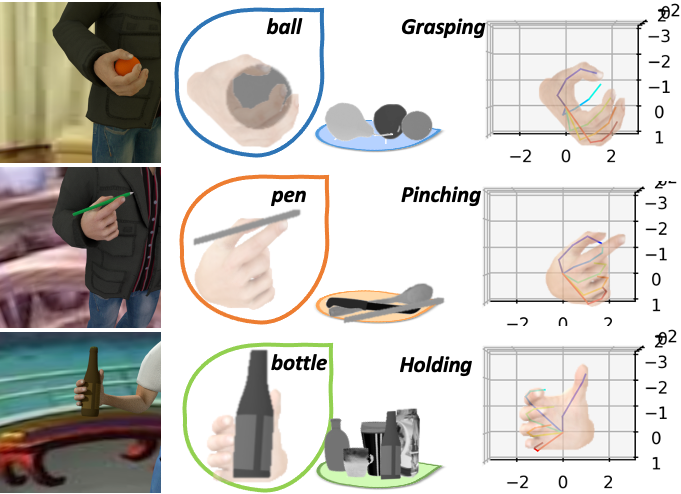

# Variational Object-aware 3D Hand Pose from a Single RGB Image


The implementation of our paper accepted in **IROS** 2019 - *jointly presented in IEEE Robotics and Automation Letters*

Authors: [Yafei Gao](https://www.linkedin.com/in/yafei-gao-0900a0131/?originalSubdomain=de), [Yida Wang](https://wangyida.github.io), [Nassir Navab](http://campar.in.tum.de/Main/NassirNavab) and [Federico Tombari](http://campar.in.tum.de/Main/FedericoTombari)

## Dataset
This dataset provides 11020 samples. Each sample provides:

+ RGB image (320x320 pixels); 
+ Segmentation mask (320x320 pixels) for *hand*
+ Segmentation mask (320x320 pixels) for *object*
+ 21 Keypoints for hand with their uv coordinates in the image frame and their xyz coordinates in the camera coordinate system
+ Intrinsic Camera Matrix


It was created with freely accessible character from *MakeHuman* and rendered with [Blender](www.blender.org)

### Introduction
The dataset ships with minimal examples, that browse the dataset and show samples.
There is one example for Phython and one for MATLAB users, both functionalities are identical.
Both files are located in the root folder.

### Download

You can find download.py from [here](https://github.com/wangyida/VO-handpose/blob/master/download.py),  then run it under your data folder:

```python
python download.py -o ./<DATA FOLDER>/
```

### File structures
```
./ 			: Root folder
./color			: Color images
./mask_hand		: Segmentation masks for hand
./mask_object		: Segmentation masks for object
./annotation.mat	: Key point annotations and camera matrices
```

If you find this work useful in your research, please cite:
```
@article{gao2019variational,
  title={Variational Object-Aware 3-D Hand Pose From a Single RGB Image},
  author={Gao, Yafei and Wang, Yida and Falco, Pietro and Navab, Nassir and Tombari, Federico},
  journal={IEEE Robotics and Automation Letters},
  volume={4},
  number={4},
  pages={4239--4246},
  year={2019},
  publisher={IEEE}
}
```
### Contact
Converning questions regarding to our dataset, please contact Yafei Gao (yafei.gao@gmx.de)
